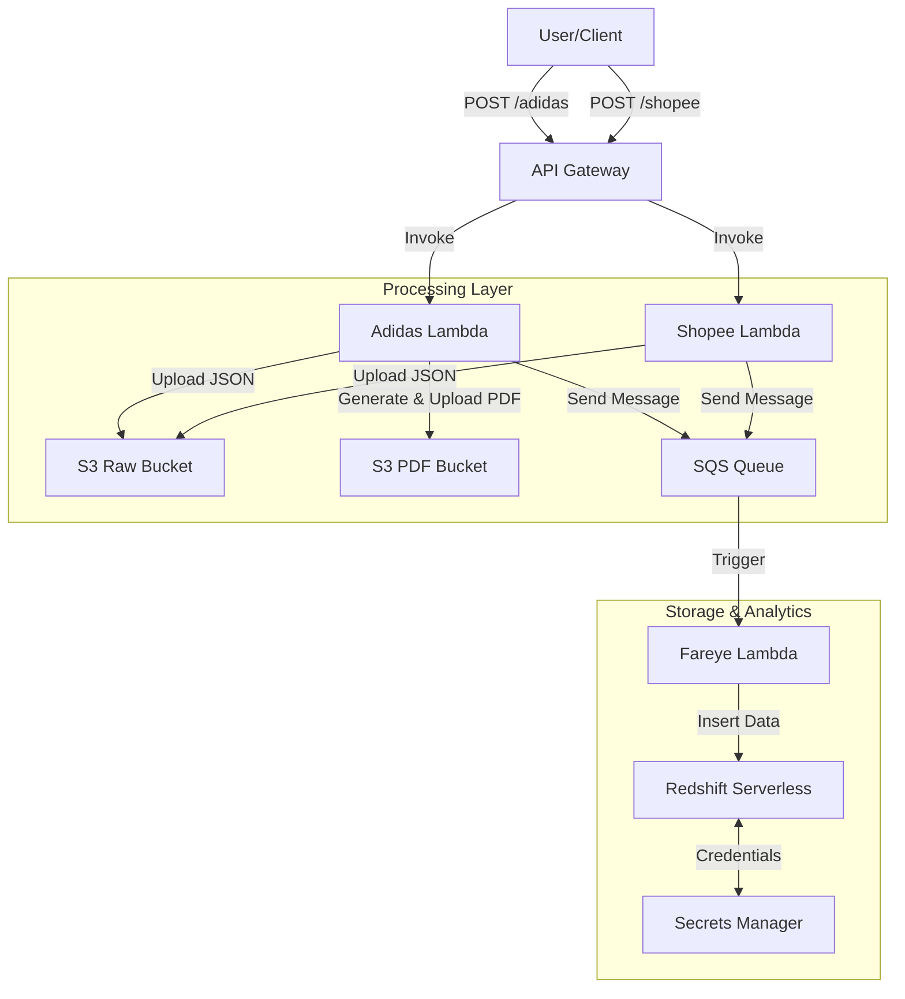

# Terraform Adidas Project


T# Terraform Adidas Final Project

This project deploys a complete serverless data pipeline on AWS using **Terraform**, **API Gateway**, **Lambda**, **S3**, **SQS**, and **Redshift Serverless**. It also includes a full CI/CD pipeline using GitHub Actions.

---

## 📌 Architecture Overview



---

## 📁 Project Structure

```
.
├── infra/                  # Terraform Infrastructure code
│   ├── main.tf             # Main configuration
│   ├── variables.tf        # Input variables
│   ├── outputs.tf          # Output values
│   ├── backend.tf          # S3 + DynamoDB backend config
│   ├── modules/            # Terraform modules
│   │   ├── s3/             # Raw & PDF buckets
│   │   ├── iam/            # IAM roles & policies
│   │   ├── lambda/         # All Lambda definitions
│   │   ├── sqs/            # SQS queue
│   │   ├── redshift/       # Redshift Serverless
│   │   ├── secret/         # Secrets Manager
│   │   └── apigw/          # API Gateway
├── lambdas/
│   ├── adidas-lambda/
│   ├── shopee-lambda/
│   ├── fareye-lambda/
│   └── fpdf-layer/
└── layer/
    └── fpdf-layer.zip
```

---

## 🛠 Prerequisites

* **Terraform v1.0+**
* **AWS CLI** configured
* **Python 3.11**

---

## 🗄 Terraform Backend Setup

### 1️⃣ Create S3 Bucket

```bash
aws s3api create-bucket \n  --bucket my-eks-terraform-state \n  --region ap-south-1 \n  --create-bucket-configuration LocationConstraint=ap-south-1
```

### Enable Versioning

```bash
aws s3api put-bucket-versioning \n  --bucket my-eks-terraform-state \n  --versioning-configuration Status=Enabled
```

### Enable Encryption

```bash
aws s3api put-bucket-encryption \n  --bucket my-eks-terraform-state \n  --server-side-encryption-configuration '{"Rules": [{"ApplyServerSideEncryptionByDefault": {"SSEAlgorithm": "AES256"}}]}'
```

### 2️⃣ Create DynamoDB Table

```bash
aws dynamodb create-table \n  --table-name terraform-lock-table \n  --attribute-definitions AttributeName=LockID,AttributeType=S \n  --key-schema AttributeName=LockID,KeyType=HASH \n  --billing-mode PAY_PER_REQUEST \n  --region us-west-2
```

### backend.tf

```hcl
terraform {
  backend "s3" {
    bucket         = "my-eks-terraform-state"
    key            = "eks/terraform.tfstate"
    region         = "us-west-2"
    dynamodb_table = "terraform-lock-table"
    encrypt        = true
  }
}
```
NEW  : 
 NEW (RECOMMENDED)
 # Terraform native lockfile (Best)
        terraform {
           backend "s3" {
            bucket       = "terraform-state-5856"
            key          = "eks/terraform.tfstate"
            region       = "ap-south-1"
            encrypt      = true
            use_lockfile = true
          }
        }


note :  No DynamoDB table required
---

## 🚀 Deployment Steps

### Initialize

```bash
cd infra
terraform init
```

### Plan

```bash
terraform plan -out tfplan
```

### Apply

```bash
terraform apply tfplan
```

---

## 🐍 Lambda Functions

### Adidas Lambda

* Stores JSON → S3 `raw/`
* Generates PDF → S3 `pdf/`
* Sends SQS message

### Shopee Lambda

* Stores JSON → S3
* Sends SQS message

### Fareye Lambda

* Triggered by SQS
* Inserts records into Redshift

---

## 🧪 Testing API

### Adidas Endpoint

```bash
curl -X POST <API>/adidas \n  -H "Content-Type: application/json" \n  -d '{"order_id":"12345","customer":"John"}'
```

### Shopee Endpoint

```bash
curl -X POST <API>/shopee \n  -H "Content-Type: application/json" \n  -d '{"order_id":"99999","store":"XYZ"}'
```

---

## 🔗 GitHub Repository

[https://github.com/sshailesh49/terraform_adidas_project](https://github.com/sshailesh49/terraform_adidas_project)

---

## 🎯 CI/CD (GitHub Actions)

The pipeline performs:

* Terraform fmt, validate, plan, apply
* Python linting (black, flake8, isort)
* Pytest
* Lambda packaging & deployment

Secrets required:

* `AWS_ACCESS_KEY_ID`
* `AWS_SECRET_ACCESS_KEY`

---

## ✔ Summary

This project provides:

* Full AWS serverless pipeline
* Modular Terraform architecture
* Automated CI/CD
* Real business use case (Adidas + Shopee payload ingestion)

You can now deploy, extend, or integrate this project easily.

## CI/CD Workflow (GitHub Actions)

Below is the complete GitHub Actions workflow used to automate Terraform, Python linting/testing, and Lambda deployments.

```yaml
name: Deploy Terraform and Lambdas

on:
  push:
    branches:
      - main
    paths:
      - "infra/**"
      - "lambdas/**"
  pull_request:
    paths:
      - "infra/**"
      - "lambdas/**"

permissions:
  id-token: write
  contents: read

jobs:

  #########################################################################
  # 1. TERRAFORM WORKFLOW — runs only when infra/ changes
  #########################################################################
  terraform:
    name: Terraform
    runs-on: ubuntu-latest
    if: contains(github.event.head_commit.message, 'infra') \
        || github.event_name == 'pull_request' \
        || github.event_name == 'push' \
        && github.ref == 'refs/heads/main' \
        && !cancelled()

    defaults:
      run:
        working-directory: ./infra

    steps:
      - name: Checkout code
        uses: actions/checkout@v3

      - name: Cache Terraform plugins & modules
        uses: actions/cache@v3
        with:
          path: |
            ~/.terraform.d/plugin-cache
            ./infra/.terraform
          key: terraform-${{ runner.os }}-${{ hashFiles('infra/**/*.tf') }}

      - name: Configure AWS Credentials
        uses: aws-actions/configure-aws-credentials@v2
        with:
          aws-access-key-id: ${{ secrets.AWS_ACCESS_KEY_ID }}
          aws-secret-access-key: ${{ secrets.AWS_SECRET_ACCESS_KEY }}
          aws-region: ap-south-1

      - name: Setup Terraform
        uses: hashicorp/setup-terraform@v2
        with:
          terraform_version: 1.5.0

      - name: Terraform Format
        run: terraform fmt -recursive

      - name: Terraform Init
        run: terraform init -reconfigure

      - name: Terraform Validate
        run: terraform validate

      - name: Terraform Plan
        run: terraform plan -input=false -out=tfplan

      - name: Upload Plan Artifact
        uses: actions/upload-artifact@v4
        with:
          name: terraform-plan
          path: ./infra/tfplan

      - name: Terraform destroy
        run: terraform destroy -auto-approve


  #########################################################################
  # 2. PYTHON LINT + TESTS — runs only when lambdas/ changes
  #########################################################################
  python-checks:
    name: Python Quality Checks
    runs-on: ubuntu-latest
    if: github.event_name == 'push' || github.event_name == 'pull_request'

    defaults:
      run:
        working-directory: ./lambdas

    steps:
      - name: Checkout code
        uses: actions/checkout@v3

      - name: Setup Python
        uses: actions/setup-python@v4
        with:
          python-version: '3.11'

      - name: Install tools
        run: |
          pip install --upgrade pip
          pip install black isort flake8 pytest boto3

      - name: Run Black (Auto-format)
        run: black .

      - name: Run isort (Import sorting)
        run: isort .

      - name: Lint with flake8
        run: |
          flake8 . --count --select=E9,F63,F7,F82 --show-source --statistics
          flake8 . --count --exit-zero --max-complexity=10 --max-line-length=127 --statistics

      - name: Run pytest
        run: pytest -q


  #########################################################################
  # 3. DEPLOY LAMBDAS — runs only on main branch & only if lambdas changed
  #########################################################################
  deploy-lambdas:
    name: Deploy Lambda Functions
    needs: [python-checks, terraform]
    if: github.ref == 'refs/heads/main' \
        && github.event_name == 'push'

    runs-on: ubuntu-latest
    strategy:
      matrix:
        include:
          - function_name: AdidasLambda
            source_dir: adidas-lambda
          - function_name: ShopeeLambda
            source_dir: shopee-lambda
          - function_name: FarEyeLambda
            source_dir: fareye-lambda

    steps:
      - name: Checkout code
        uses: actions/checkout@v3

      - name: Configure AWS Credentials
        uses: aws-actions/configure-aws-credentials@v2
        with:
          aws-access-key-id: ${{ secrets.AWS_ACCESS_KEY_ID }}
          aws-secret-access-key: ${{ secrets.AWS_SECRET_ACCESS_KEY }}
          aws-region: us-east-1

      - name: Package Lambda Source
        working-directory: ./lambdas/${{ matrix.source_dir }}
        run: |
          zip -r function.zip .

      - name: Deploy Lambda Code to AWS
        working-directory: ./lambdas/${{ matrix.source_dir }}
        run: |
          aws lambda update-function-code \
            --function-name ${{ matrix.function_name }} \
            --zip-file fileb://function.zip
```

