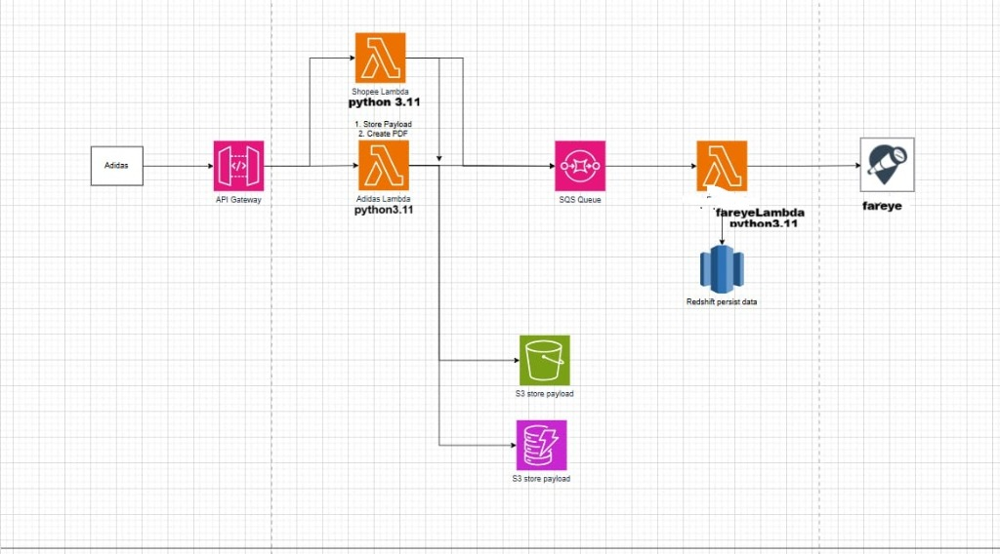

# Terraform Adidas Project



This project manages AWS infrastructure using Terraform and deploys Python Lambda functions for data processing. It includes a complete CI/CD pipeline using GitHub Actions.

# TERRAFORM
# Create  S3 bucket  :

      aws s3api create-bucket \
        --bucket my-eks-terraform-state \
        --region ap-south-1 \
       --create-bucket-configuration LocationConstraint=ap-south-1
    
NOTE  Not use  -- create-bucket-configuration LocationConstraint in us-east-1
Enable versioning and encryption (recommended for Terraform)
 # Enable versioning:
    aws s3api put-bucket-versioning \
       --bucket my-eks-terraform-state \
       --versioning-configuration Status=Enabled

# Enable server-side encryption:
         aws s3api put-bucket-encryption \
         --bucket my-eks-terraform-state \
         --server-side-encryption-configuration '{
           "Rules": [{
              "ApplyServerSideEncryptionByDefault": {
               "SSEAlgorithm": "AES256"
             }
           }]
         }'


# Create DynamoDB Table for State Locking
         
         aws dynamodb create-table \
         --table-name terraform-lock-table \
         --attribute-definitions AttributeName=LockID,AttributeType=S \
         --key-schema AttributeName=LockID,KeyType=HASH \
         --billing-mode PAY_PER_REQUEST \
         --region us-west-2

# Verify Table Created
         aws dynamodb list-tables --region us-west-2

# NOW #  Ready to Use with Terraform
  -- backend.tf 
    
         terraform {
                  backend "s3" {
                        bucket         = "my-eks-terraform-state"
                                    key            = "eks/terraform.tfstate"
                                   region         = "us-west-2"
                                  dynamodb_table = "terraform-lock-table"
                                   encrypt        = true
                                                }
                               }
## Repository
[https://github.com/sshailesh49/terraform_adidas_project](https://github.com/sshailesh49/terraform_adidas_project)

## Project Structure
- `infra/`: Terraform code for AWS infrastructure (API Gateway, Lambda, S3, SQS, Redshift).
- `lambdas/`: Python source code for Lambda functions (AdidasLambda, ShopeeLambda, FarEyeLambda).
- `.github/workflows/`: CI/CD pipeline configuration.

## Prerequisites & Dependencies

### Tools
- **Terraform**: v1.5.0 or later
- **Python**: v3.11
- **AWS CLI**: Configured with appropriate permissions

### Python Dependencies
The Lambda functions and testing suite require the following packages:
- `boto3`
- `fpdf`
- `pytest`
- `black`
- `isort`
- `flake8`

## Installation & Setup

### 1. Clone the Repository
```bash
git clone https://github.com/sshailesh49/terraform_adidas_project.git
cd terraform_adidas_project
```

### 2. Infrastructure (Terraform)
Navigate to the infrastructure directory:
```bash
cd infra
```

Initialize Terraform:
```bash
terraform init
```

Plan the deployment:
```bash
terraform plan -out=tfplan
```

Apply the configuration:
```bash
terraform apply tfplan
```

### 3. Lambda Functions (Python)
Navigate to the lambdas directory to run local checks or tests:
```bash
cd lambdas
```

Install dependencies:
```bash
pip install -r requirements.txt # if available, otherwise install individually
pip install boto3 fpdf pytest black isort flake8
```

Run tests:
```bash
pytest
```

## GitHub Actions CI/CD
The project includes a GitHub Actions workflow (`.github/workflows/deploy.yml`) that automates:
1. **Terraform**: Format, Init, Validate, and Plan (and Apply on `main`).
2. **Python Quality Checks**: Black, Isort, Flake8, and Pytest.
3. **Deploy Lambdas**: Packages and deploys Lambda functions to AWS on `main` branch push.

### Secrets
Ensure the following secrets are configured in your GitHub Repository:
- `AWS_ACCESS_KEY_ID`
- `AWS_SECRET_ACCESS_KEY`
